# 
SCI

### Odkazy

- NSK - [https://www.narodnikvalifikace.cz/kvalifikace-1858-Instruktorinstruktorka_lezeni_na_skalach](https://www.narodnikvalifikace.cz/kvalifikace-1858-Instruktorinstruktorka_lezeni_na_skalach)
- [https://www.horosvaz.cz/instruktori-sci-rci-a-hal/kvalifikace-sci/](https://www.horosvaz.cz/instruktori-sci-rci-a-hal/kvalifikace-sci/)
- [https://www.horosvaz.cz/narodni-soustava-kvalifikaci/](https://www.horosvaz.cz/narodni-soustava-kvalifikaci/)
- ČHS - metodické karty [https://www.horosvaz.cz/doporuceni-a-informace/metodika-doporuceni/](https://www.horosvaz.cz/doporuceni-a-informace/metodika-doporuceni/)
- Kniha "Lezeme a šplháme" - [https://www.databazeknih.cz/knihy/lezeme-a-splhame-108833](https://www.databazeknih.cz/knihy/lezeme-a-splhame-108833)

## Osnova kurzu SCI

### Horolezecké značky
[https://horolezeckametodika.cz/horolezecke-znacky](https://horolezeckametodika.cz/horolezecke-znacky)

### Tištěné průvodce, ochrana životního prostředí, povolení vstupu do skalních oblastí (kde ziskat informace), význarnné skalní oblasti ČR, vlastnosti hornin
- Skály ČR – webová databáze na [https://horosvaz.cz](https://horosvaz.cz) + mobilní aplikace
- Celkový přehled skalních oblastí ČR + mapka např. zde: [https://www.skalnioblasti.cz/4_ovk_index.asp?cmd=5](https://www.skalnioblasti.cz/4_ovk_index.asp?cmd=5)
- Základní rozdělení hornin:
  - Vyvřeliny (magmatické horniny) – žula, syenit, čedič, ...
  - Usazeniny (sedimentární horniny) – pískovec, vápenec, ...
  - Přeměněné horniny (metamorfované) – svor, břidlice, rula, ...
    - Vznikají působením teploty a tlaku na jiný typ horniny

### vhodný oděv a doplňky (povinná lezecká helma), upozornit na nebezpečné osobní předměty, které mohou způsobit zraněni
- Nevhodné jsou zejména: prstýnky, řetízky, hodinky, nestažené dlouhé vlasy, oblečení limitující v pohybu - např. příliš volný oděv.
- Přilbu dle oblasti už pod skalou
- Vhodný pohodlný oděv, který nelimituje pohyb, také s ohledem na počasí

### pravidla bezpečného pohybu a chování v nelezeckém terénu (přístupové cesty), v lezeckém terénu (okrajové skály a věže)
- V případě potřeby např. přidat pomocné lano k přidržování se nebo jako zábradlí, popř. klienty odjistit.
- Nevzdalovat se bez vědomí instruktora, skupina jde společně.
- Přilby, sedáky – v případě "cvakání se" do lanového zábradlí

### 0značení cest podle stupnice obtižnosti (UIAA, Francouzská stupnice)
- Obtížnost cesty se hodnotí podle nejtěžšího kroku.
- Stupnice obtížnosti:

  - UIAA: Římské číslice, popř. arabské. Může být doplněná znaménkem plus nebo minus.

    Např.: V+, 5+

  - Francouzská stupnice: Arabská číslice a malé písmeno a, b nebo c.

    Např.: 5a

  - Bouldrová stupnice: Arabská číslice a velké písmeno A, B nebo C

    Např. 5A, 7B

  - Saská (pískařská) stupnice: Římská číslice od stupně VII může být doplněná písmenem b, c. Menší obtížnosti než VII nemají písmeno.

    Např. VIIb

  - Převod mezi stupnicemi UIAA a Francouzskou:
Např. zde na str. 6: [https://theuiaa.org/documents/mountaineering/THESCALESOFDIFFICULTYINCLIMBING_p1b.pdf](https://theuiaa.org/documents/mountaineering/THESCALESOFDIFFICULTYINCLIMBING_p1b.pdf)

Nejtěžší cesta na světě: "Silence" v Norsku, obtížnost 9c+ (odpovídá cca UIAA 12). Autor - Adam Ondra.

### určt vhodny počet osob ve skupině při vedení různych druhů výcviku
- Vhodný počet osob je takový, abych zvládl všechny body metodického výstupu
- Vždy řešíme maximální počet klientů na jednoho instruktora, aby byla zajištěna:
    - bezpečnost
    - srozumitelnost
- [https://www.horosvaz.cz/res/archive/564/096088.pdf?seek=1746773719](https://www.horosvaz.cz/res/archive/564/096088.pdf?seek=1746773719)

### Uvest a charakterizovat nezbytnou dokumentaci pro vedení výcviku (základni zdravotní deklarace, dohoda o pravidlech a zodpovědnost klienta a instruktora)
- Jestli je povolené v oblasti pořádat kurz
- Jestli je vstup na skálu omezený jen na členy ČHS
- Informace o zdravotním stavu
- Žádné drogy a alkohol
- Pravidla umělé stěny - provozní řád (může zakazovat některé činnosti - např. slaňování)
- Kniha úrazů

### Použivané pomůcky a lezecký material

### Druhy jištění, styly přelezu - kritérium obtžnosti (OS, RP, PP, TR)
- Fixní jištění:
    - Borhák (vždy lepený, dloušťka a délka dle horniny, lze z něho nouzově slanit, protože je oblý)
    - Nýt - Plaketa připevněná expanzním šroubem. Má ostré hrany, musí se cvakat kov (karabina), nemůže se přímo vložit textilní materiál.
    - Kruh - Ve starších skalních cestách a nebo na písku.

- Vrcholové jistící stanoviště:
    - Staré uspořádání: Dva nýty/borháky v jedné rovině
    - Nové uspořádání (vhodnější): Jeden nýt/borhák níže, druhý výše a diagonálně. Podle pozice nýtů jde odhadnout směr dalšího pokračování vícedélkové cesty (kterým směrem odlézt do další délky).

- Styly přelezu - info: [https://www.horoakademie.cz/styly-prelezu-os-rp-tr/](https://www.horoakademie.cz/styly-prelezu-os-rp-tr/)
  - OS - On sight
  - RP - Rot punkt, Red point
  - PP - Pink point - jako RP, ale v jištění už jsou nacvakané expresky
  - TR - Top rope

### Druhy a použití různých druhủ lan, smyček a pomocných šňůr, orientace v jejich značení a nosnosti
- Druhy lan:
  - statické - Pro výškové práce. Nejsou určena k zachycení pádu.
  - dynamické - Určeny k horolezectví a k zachycení pádu:
      - Dělení:
        - jednoduché - &#9312;
        - poloviční - (1/2)
        - dvojité - ⚭
      - Min. počet normovaných pádů lana je 5 (u dvojitých lan 12).
      - Statická průtažnost dyn. lana je max. 10 % (např. odsed na top rope), dynamická průtažnost až 40 % (tvrdý pád prvolezce).

- Nesešité ploché smyce mají být označeny třemi čárkami, což znamená min. nosnost 3x500 = 1500kg.
- Sešité ploché smyce mají dle normy nosnost min. 22 kN (2200 kg).

- Pomocné šňůry (prusíky) se doporučují s průměrem 6 mm, popř. kevlarové 5,5 mm.

### Druhy a použití různých karabin, jejich značení a nosnosti
- [https://ucebnice.horskasluzba.cz/cz/odborna-cast/zaklady-horolezectvi/material/karabiny](https://ucebnice.horskasluzba.cz/cz/odborna-cast/zaklady-horolezectvi/material/karabiny )

  - Dělení podle materiálu
    - Ocelové (pracovní, záchranáři, umělé stěny)
    - Ze slitin hliníku (lehké, pro horolezectví)

  - Dělení podle tvaru
    - D = Directional (základní karabina)
    - H = HMS
    - X = Oválná
    - K = Klettersteig (feratová dlaňovka) - je testovaná i na zatížení v lomu
    - Q = Quick-link (mailona)

  - Dělení podle pojistky
    - karabiny bez pojistky
    - karabiny s pojistkou
      - šroubovací pojistka
      - twist-lock
      - triple-lock (popř. ball-lock)

- Značení nosnosti karabin např. zde: [https://horolezeckametodika.cz/wp-content/uploads/karabznac.jpg](https://horolezeckametodika.cz/wp-content/uploads/karabznac.jpg)

  - Nosnost v podélném směru (nejvyšší)
  - Nosnost v příčném směru
  - Nosnost s otevřeným zámkem
    - Nosnost s otevřeným zámkem se uplatní i při nezašroubované pojistce.

### správné používání, skladováni, evidence, kontrola a vyřazování lezeckého materiálu v souladu s normou EN a pokyny výrobce
- Textilní materiál - odstranění pásek nebo jiného překryvu, vizuální kontrola, kontrola hmatem. Fleky neznámého původu (možné chemické poškození) -> vyřazovat.
- Kovový materiál - vrypy, probrusy, ostré hrany, vybroušené drážky u jistítka apod. Max. tolerovatelný probrus je 1/5.
- Helma a úvazky - vizuální kontrola, kontrola hmatem (promačkat helmu), kontrola spon, kontrola fleků. Kontrola pevnostního šití v nosných částech. Pevnostní švy bývají obvykle v kontrastní barvě.
- Lano - kontrolovat po celé délce, vizuálně a vždy i hmatem (přebrat lano v ruce).
- Rozvázat uzly ze všech smyček - pokud nejdou rozvázat, vyřadit.
- Friend, vklíněnec - kontrola všech prvků, kovových i textilních.
- Vytažená nit u smyček nebo pomocných šňůr -> vyřadit. Doporučeno používat kevlarové šňůry 5,5 mm.
- Kontrola funkčnosti vybavení - rozhoduji se mezi dvěma stavy: funguje vs. nefunguje.
- Vyřadit pomocné šňůry o nevhodných průměrech <6mm, >7mm.
- Je vhodné, aby instruktor měl náhradní materiál pro klienty - pokud jim něco vyřadí z používání.
- Typy kontroly:
    - Revize (provádí revizní technik)
    - Vizualní kontrola před lezením
    - Evidenční – vyřazení dle stáří a životnosti

### popis základních jisticich pomůcek (kyblík a poloautomat)
- Kyblík - základní "manuální" pomůcka
  - vyvinul se z tzv. Stichtovy brzdy (destička s otvory)
- Poloautomat
  - pomahá zachytit pád, nedavá prokluz při pádu
  - pro uvolnění lana (podávání nebo spuštění) je potřeba udělat nějaký úkon k odblokování
  - rozdělení poloautomatů
    - Pákové (např. Rama, Smart, Mega Jul)
    - Vačkové (Grigri, Neox, Pinch)
    - Ostatní (Click Up, Revo)
  - partner-check u poloautomatů: musím zatáhnout za lezcovo lano, abych vyzkoušel samosvornou funkci poloautomatu
- Osma je pouze slaňovací pomůcka, nikoli jisticí. Nebezpečná především s novými lany. Hodí se na specifické případy (canyoning, speleologie - špinavé nebo mokré lano).

### pádový faktor (výpočet pádového faktoru a rázové síly) vysvětlit s různými druhy jištění, fixniho osazení skal
- Pádový faktor
  - Výpočet: Délka pádu / činná délka lana (zachycující pád)
  - Je to bezrozměrné číslo (nemá fyzikální jednotku, je to prostý poměr)
  - Udává "tvrdost" pádu.

- Rázová síla
  - je maximální síla působící na lezce v okamžiku pádu
  - nelze ji spočítat, měří se ale například při laboratorních zkouškách lan
  - platí: vyšší pádový faktor -> vyšší rázová síla

- Nejvyšší pádový faktor při lezení s lanem je při odlézání ze štandu před založením prvního postupového jištění (max. hodnota 2).
- Proto je důležité založit co nejdříve první postupové jištění.

- Pádový faktor se zvyšuje, pokud se lano tře v expreskách, o skálu apod., protože se snižuje aktivní délka lana, která zachytává pád.

- Vysoké hodnoty pádového faktoru se můžou vyskytnout na ferratách (více než 2). Proto je nezbytné používat feratovou brzdu s tlumičem pádu.

### Uzly
- Typy uzlů:
    - Kotevní:
      - osmička,
      - dvojitá dračí smyčka
      - alpský motýlek
      - stejnosměrný vůdcovský (popř. jiné stejnosměrné)
      - lodní
      - ...
    - Spojovací
      - rybářská spojka
      - stejnosměrný vůdcovský (např. spojení lan při slanění)
      - protisměrný vůdcovský (popř. jiné protisměrné)
    - Ostatní
      - poloviční lodní (jištění, spouštění)
      - prusíky (stoupání po laně, )

**Dvojitá dračí smyčka**

Pozor - video ukazuje uzel bez pojistky. Vhodnější je navázat za dvojitou dračí smyčku pojišťovací uzel (dvojitý?).

Dvojitá d. s. je vhodná jen na trénink pádu, jinak není doporučována a není důvod ji používat.



**Navazování na sedák a prsák pomocí lana**

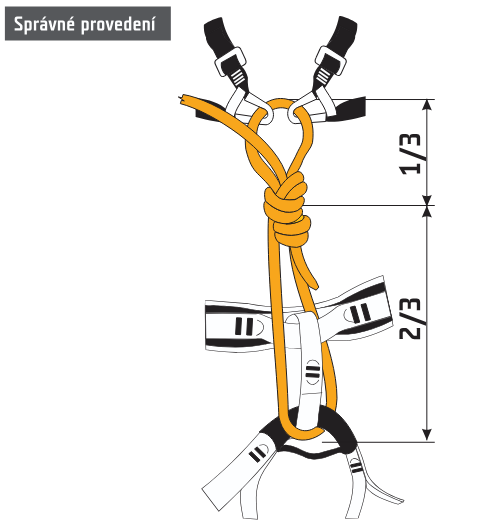

[https://www.horosvaz.cz/res/archive/293/046566.pdf?seek=1565180726](https://www.horosvaz.cz/res/archive/293/046566.pdf?seek=1565180726)

**Navazování na sedák a prsák pomocí smyčky - tzv. alpský způsob navázání**

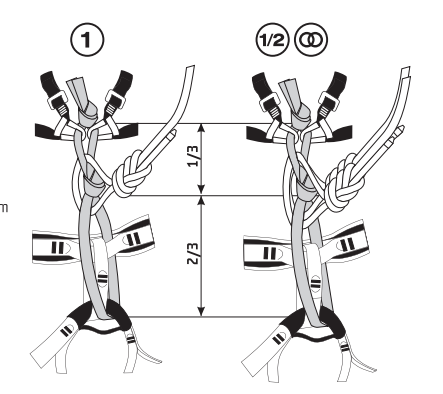

[https://www.horosvaz.cz/res/archive/128/048840.pdf](https://www.horosvaz.cz/res/archive/128/048840.pdf)

Konce lan nejméně 10ti násobek průměru lana, u ploché smyčky 5ti násobek šířky (délka cca do vzdálenosti sevřené dlaně se vztyčeným palcem), tolerance plus 5 cm. Delší je nebezpečný, svádí k navázání dalšího uzlu.

Při protisměrném vůdcovském uzlu - volné konce alespoň 30 cm.

### Guidelines

1. Správně provedený partner-check
   - https://www.horosvaz.cz/res/archive/310/052445.pdf
   - https://www.youtube.com/watch?v=dSwb9RBG5TY
1. Kontrolní odsednutí
1. Správná práce a pozice jistící ruky

### Schéma metodického výstupu

- Vysvětlit
- Ukázat
- Procvičit
- Ověřit

### Zakravení jistítka typu kyblík

Dávám pozor na založení lana na správnou stranu v kyblíku - směrem k zádům karabiny - aby šlo zakravení dobře provést.

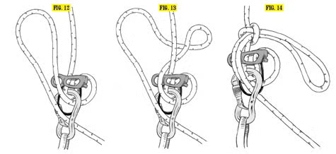

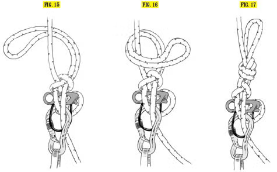

### Zřízení vratného bodu top-rope

ČHS doporučuje ve vratném bodu:
- dvě karabiny stejného typu s pojistkou zámku, zámky proti sobě
- nebo jedna karabina s pojistkou zámku, pojištěná jednou expreskou

Pokud vratný bod odsazuji pomocí smyčky a ve fixním bodě mohou slaňovat jiní lezci, musím do fixního bodu dát karabinu - jinak by hrozilo přepálení smyčky cizím lanem.

### Zrušení vratného bodu top-rope s následným spuštěním

[https://www.horosvaz.cz/res/archive/310/052449.pdf](https://www.horosvaz.cz/res/archive/310/052449.pdf)

### Zrušení vratného bodu top-rope s následným slaněním

[https://www.horosvaz.cz/res/archive/310/052448.pdf](https://www.horosvaz.cz/res/archive/310/052448.pdf)

### Slanění "na zvoníka"

1. Instruktor udělá pojistný uzel na lano (oba prameny)
1. Instruktor si nad uzel založí kyblík (uzel + kyblík slouží jako pojistka)
1. Klient, co bude slaňovat poslední, si založí kyblík a udělá kontrolní odsed (co nejvýše), odepne odsedku
1. Instruktor chytí lano pod kyblíkem rukou
1. Druhý klientu udělá to, co první. Klient posune kyblík co nejvýše
1. Instruktor udělá kontrolní odsed a slaní
1. Posléze další klient slaní
1. Na závěr poslední klient slaní

Štand se nesmí odlehčit!
- Slaňující musí stále sedět v laně, nikdy lano neodlehčit
- Jak klient slaní na zem, musí instruktor lano nad klientem zatížit rukou
- Instruktor na zemi drží obě dvě lana v ruce (připraven zastavit slanění zatažením za lana)

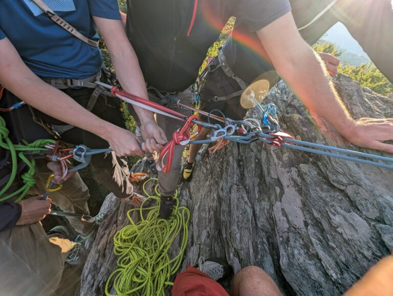

### Slanění "na kouzelnika"

1. klient, co bude slaňovat poslední, založí prusík a kyblík + kontrolní odsed
1. instruktor uváže kouzelnický uzel do HMS + cvakne do centrálky
   - kouzelnický uzel musí být správně orientovaný (taháním za volný konec se musí dotahovat)
1. další klient založí prusík a kyblík + kontrolní odsed
1. instruktor uváže další kouzelnický uzel do HMS + cvakne do centrálky
1. instruktor se připraví na slanění, kontrolní odsed a slaní
1. klient odebere HMS s uzlem a slaní
1. totéž udělá další klient

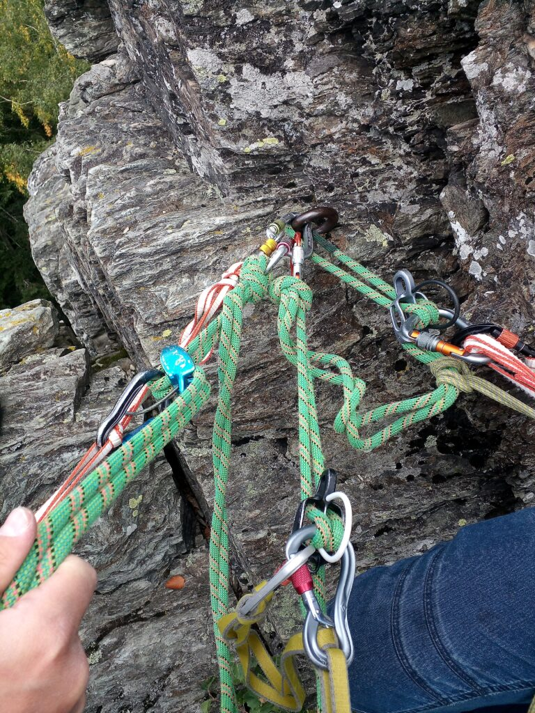

### Spuštění klienta přes uzel (přes defekt na laně)

1. Spouštím přes poloviční lodní uzel (HMS ve štandu).
1. Narazím na defekt na laně.
1. Zakravím půlloďák
1. Uvážu vůdcovský protisměrný uzel okolo defektu
1. Odkravím půlloďák, pokračuji ve spouštění
1. Uzel projde 2x karabinou a 1x okem polovičního lodního uzlu
1. Průchod uzlu usnadním vložením konců lana do oka a silným zatažením
1. Pak pokračuji ve spouštění normálně

### Slanění přes uzel (slanění přes defekt na laně)

1. Slaňuji se sebejištěním (s prusíkem).
1. Slanění zastavím cca 10-15 cm nad uzlem.
1. Navážu další prusík těsně nad kyblík. Používám dlouhý prusík, min 3 m, raději více.
1. Dám karabinu do centrálního oka, uvážu půlloďák a zakravím v ní dlouhý prusík.
   - Před zakravením půlloďák otočím do módu pro spouštění.
   - Prusík co nejvíc dotáhnu.
1. Pokračuji se slaněním těsně nad uzel.
   - Měl bych se tím převěsit do prusíku a uvolnít slaňovací pomůcku.
   - Pokud ne, vytáhnu prusík výš (více ho napnu).
1. Převážu prusík pro jištění během slaňování pod uzel.
1. Předělám kyblík pod uzel.
1. Odkravím půlloďák na prusíku a spustím se.
   - Měl bych zatížit slaňovací pomůcku.
1. Odvážu dlouhý prusík nad uzlem.
   - Pokud na prusík nemůžu dosáhnout, omotám lano kolem špičky nohy a zvednu se.
1. Pokračuji ve slaňování pod uzlem.

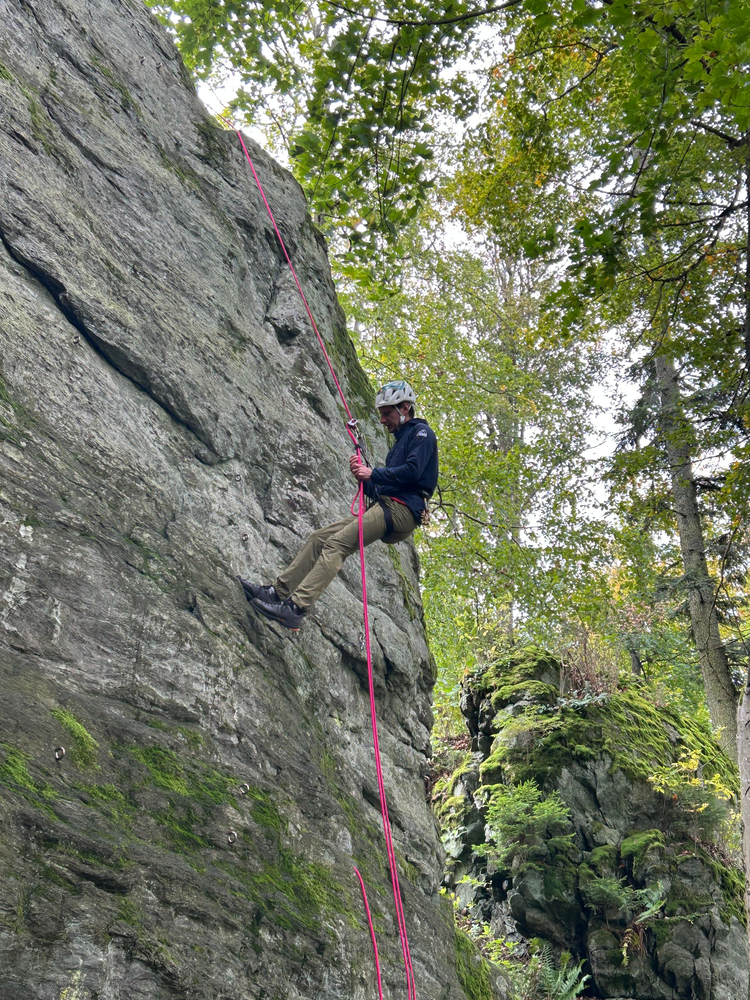
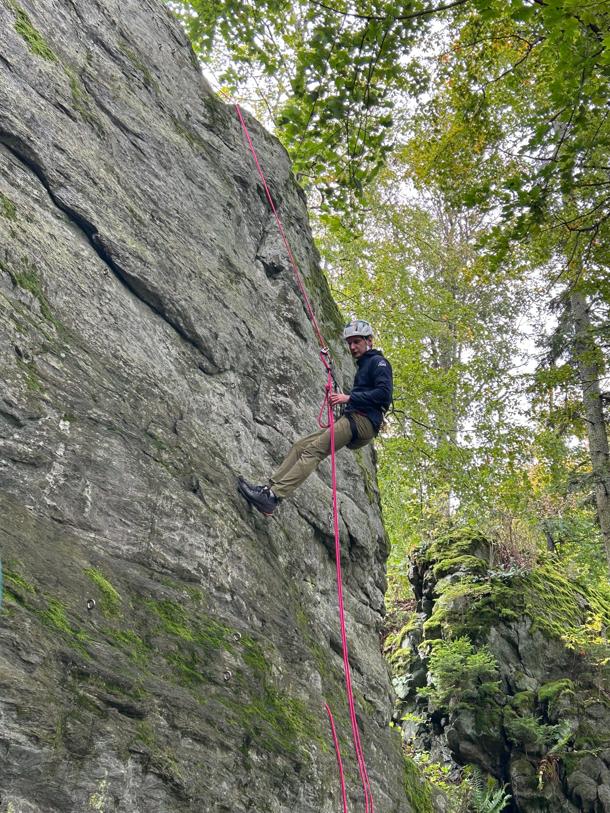
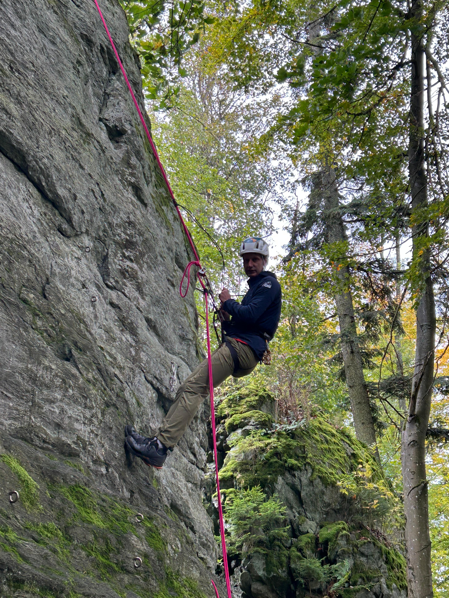

### Vybudování štandu s preferencí jednoho bodu (štand osazen nýty/borháky)

Metodická karta: https://www.horosvaz.cz/res/archive/199/048839.pdf

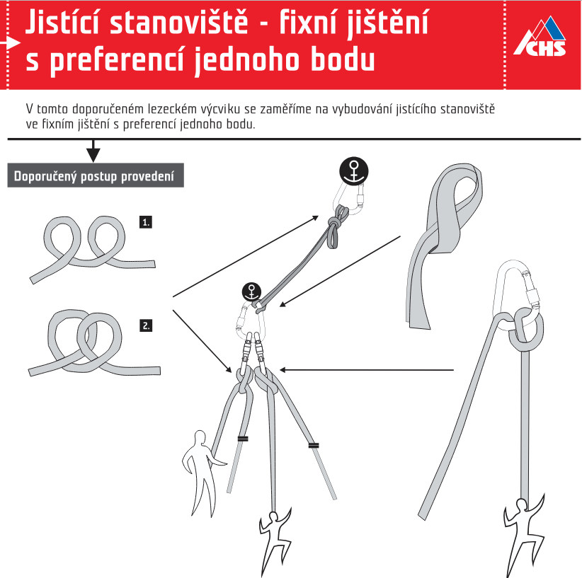

### Vybudování štandu pomocí dočasných jistících pomůcek

Štand provazuji plochou smyčkou (např. tenká dyneema) nebo kevlarovou šňůrou. Polyamidová 6mm reep se nepoužívá (nízká nosnost).

Používám liščí uzel v centrální karabině. Do uzlu musí vést minimálně tři prameny na každé straně.

Mám-li 3 nebo více založených pomůcek, nemusím na nich mít karabiny s pojistkou.

Pokud je to možné, štand provazuji i zespodu do protitahu - aby nedošlo k nadzvednutí štandu při pádu prvolezce v další délce.

### Bezpečné zajištění a vylezení cesty 4 UIAA s pomocí zakládaných jistících pomůcek

- pravidlo 2, 3, 5, 3-5 m: zakládám ve 2, 3 a 5ti metrech, následně po 3-5ti metrech, prvolezec nesmí spadnout na zem

### Tvorba odsazeného štandu

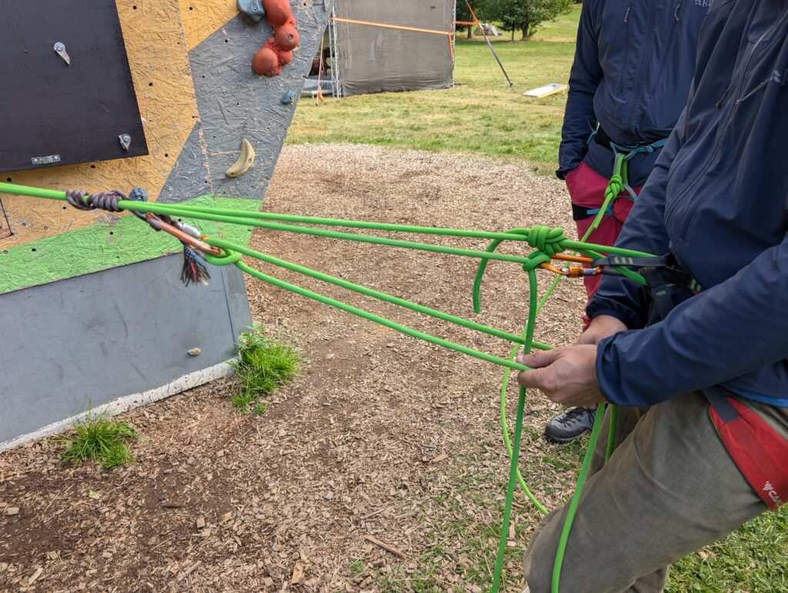
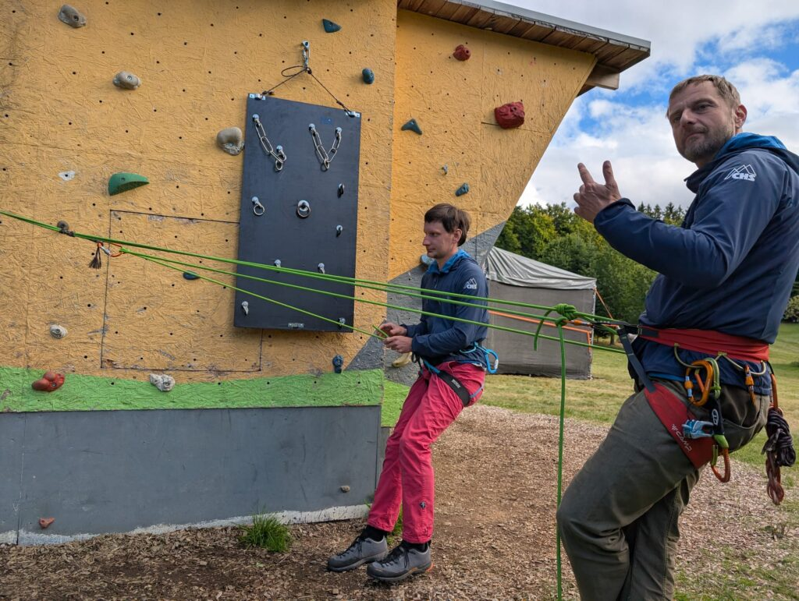

### Záchranná technika směrem nahoru – dopomoc druholezci (kýbl i HMS)
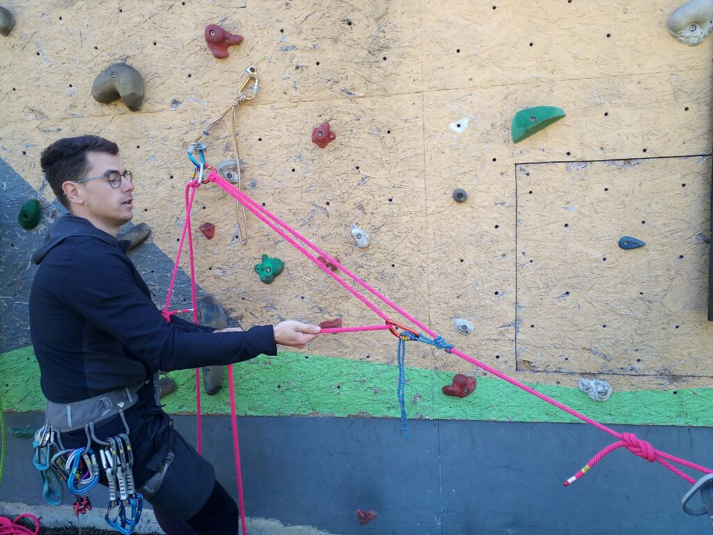

### Záchranná technika směrem dolů – spuštění druholezce odblokováním kyblíku
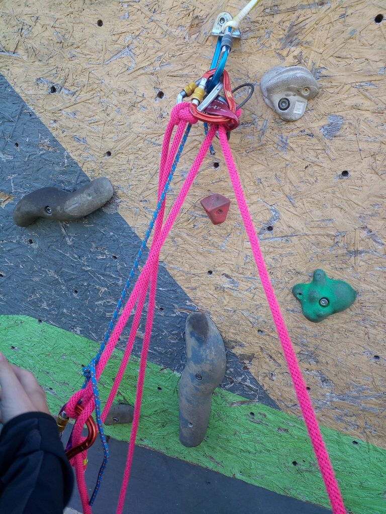

### Nácvik chytání pádů

Chytání pádů na top-rope - 3 cvičení:
   1. Odsednutí do lana
   1. Prokluz lana pod jistítkem
      - Klient se druhou rukou chytne vzadu za sedák, aby nesevřel reflexivně lezcovo lano a nepopálil se.
   1. Průvěs lana nad jistítkem
      - Instruktor lano napíná nad jistítkem, aby se prvolezci volné lano nepletlo a neměl pocit průvěsu (nedobrané lano).

Chytání pádů prvolezce - 2 cvičení:
   1. Chytání pádu bez prokluzu
   1. Chytání pádu s prokluzem
      - Vodicí ruka klienta drží lano jen zlehka (palec a dva prsty), aby nedošlo k sevření a popálení při prokluzu.
      - Ruka instruktora v kontaktu s brzdnou rukou jističe.

Instruktor funguje po celou dobu jako záložní jistič.

Každé cvičení je vhodné opakovat min. dvakrát - poprvé může být jistič překvapený, podruhé už je připraven reagovat lépe.

